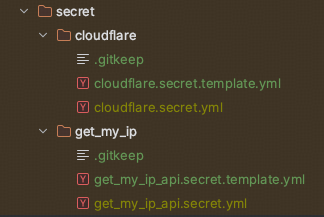

# Dynamic DNS Server

## Usage

### Build from code

1. clone this project
    ```shell
    git clone https://github.com/Anonymouscn/dynamic-dns-server.git
    ```

2. setup secret folder, create secret file as the template

    

3. check the config in `application.yml`

    ```yaml
    name: "DNS 自动化脚本"
    type: cloudflare # 使用的域名注册服务商 (目前仅支持 cloudflare)
    duration: 60 # 脚本检查间隔时间 (秒/s, 最小 60s)
    get_my_ip_api: ./secret/get_my_ip/get_my_ip_api.secret.yml # get_my_ip api 接口
    cloudflare:
      secret: ./secret/cloudflare/cloudflare.secret.yml # cloudflare secret 文件路径
      proxy: true # 是否由 CDN 代理
      ttl: 300 # DNS 缓存生存时间 (秒/s, 最小 300s = 5min)
      type: A # 域名记录类型 (默认为 A, 主记录)
    ```
   
   you can build an IP acquisition service, and setup `get_my_ip_api`.

   more about get_my_ip service: [get_my_ip_service_repo](https://github.com/Anonymouscn/ip-server)

   clone:
   ```shell
   git clone https://github.com/Anonymouscn/ip-server.git
   ```

4. build project with docker

    ```shell
    ./build.sh # on unix/linux
    ```
    
    ```shell
    ./build.bat # on windows
    ```
   
5. save docker image and secret archive in `bin` folder

   you can get a random password to unzip the secret folder when it finished
   ```shell
   View build details: xxx
   secret 随机密码: xxx
   adding: secret/ (stored 0%)
   adding: secret/cloudflare/ (stored 0%)
   adding: secret/cloudflare/cloudflare.secret.template.yml (deflated 47%)
   adding: secret/cloudflare/.gitkeep (stored 0%)
   adding: secret/cloudflare/cloudflare.secret.yml (deflated 21%)
   adding: secret/get_my_ip/ (stored 0%)
   adding: secret/get_my_ip/get_my_ip_api.secret.template.yml (stored 0%)
   adding: secret/get_my_ip/get_my_ip_api.secret.yml (stored 0%)
   adding: secret/get_my_ip/.gitkeep (stored 0%)
   ```

### Pull from docker hub

1. pull images

   ```shell
   docker pull pgl888999/dynamic-dns-server
   ```

2. run a container

   ```shell
   docker run --name $container_name -v $path_to_secret:/app/secret -itd pgl888999/dynamic-dns-server
   ```
   
### Tips

* check logs on docker container
   ```shell
   docker logs $container_name
   ```
  such as:
   ```shell
   2024/12/09 02:45:59 cloudflare dynamic DNS is active
   2024/12/09 02:46:00 current IP: xxx[proxied]
   2024/12/09 02:46:02 current dns: xxx[proxied]
   2024/12/09 02:46:02 current IP config has not changed and does not need to be updated.
   ```